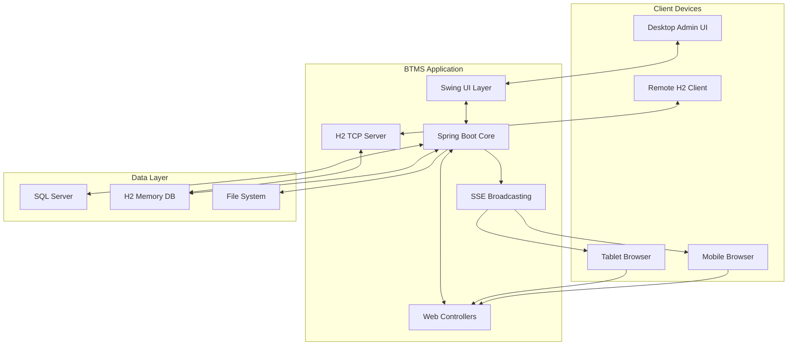

# 🏸 Hệ thống Quản lý Giải đấu Cầu lông (BTMS) · v1.2.2

> **📅 Cập nhật mới nhất**: January 3, 2026  
> **🏗️ Kiến trúc**: Hybrid Desktop + Web Application  
> **🎯 Phạm vi**: Professional Tournament Management với Multi-machine Network Support

> **📋 Language Versions / Phiên bản ngôn ngữ**:
>
> - [🇻🇳 Tiếng Việt](README_VI.md) - Phiên bản tiếng Việt
> - [🇺🇸 English](README_EN.md) - English version

Hệ thống quản lý giải đấu cầu lông toàn diện với **kiến trúc hybrid độc đáo**, kết hợp desktop application và web platform cho khả năng điều khiển đa sân real-time.


---

## 🎯 Tổng quan dự án

**BTMS (Badminton Tournament Management System)** là một hệ thống quản lý giải đấu cầu lông **enterprise-grade** với kiến trúc hybrid độc đáo, tích hợp:

### 🚀 **Kiến trúc Core**

- **🖥️ Desktop Application**: Giao diện quản trị chuyên nghiệp với Java Swing + FlatLaf modern UI
- **🌐 Web Platform**: Responsive interface cho mobile/tablet với PIN-based access
- **⚡ Real-time Synchronization**: Server-Sent Events (SSE) + UDP Multicast cho real-time updates
- **🏟️ Multi-Court Management**: Có thể quản lý **5 sân đồng thời** hoặc nhiều hơn với thread-safe operations
- **💾 Enterprise Database**: SQL Server primary + H2 TCP server cho remote access

### 🌟 **Innovation Highlights**

- **Hybrid Architecture**: Desktop + Web trong **cùng 1 JVM process**
- **Cross-platform Control**: Desktop admin + mobile remote control
- **Professional Deployment**: Windows MSI installer với **JRE bundled**
- **Network Flexibility**: IPv4-only filtering, interface selection, remote DB access

### 📊 Thông tin kỹ thuật

- **Phiên bản**: 1.2.2 (Multi-machine Network Support with H2 TCP & UDP Multicast)
- **Tác giả**: Nguyen Viet Hau (@NguyenHau-IT)
- **Runtime**: Java 21 LTS với enhanced threading features
- **Framework**: Spring Boot 3.4.0 (Non-headless mode)
- **Database**: SQL Server (primary) + H2 TCP Server (remote access)
- **Network Ports**: 2345 (Web/API), 9092 (H2 TCP), 50505 (UDP Multicast)
- **Platform**: Windows 10/11 64-bit
- **Repository**: [GitHub](https://github.com/NguyenHau-IT/Badminton_Tournament_Management_System_DB_SQLSRV)
- **License**: MIT License

---

## 🚀 Tính năng chính

### 🏟️ Quản lý đa sân

- Điều khiển nhiều sân thi đấu đồng thời
- Mỗi sân có mã PIN 4 chữ số duy nhất
- Hỗ trợ cả đơn và đôi (Singles/Doubles)
- Bảng điểm hiển thị dọc/ngang tùy chỉnh

### 📱 Điều khiển từ xa

- Web interface responsive cho mobile/tablet
- Truy cập bằng mã PIN qua `/pin` hoặc `/scoreboard/{pin}`
- Điều khiển điểm số real-time
- QR Code để truy cập nhanh

### 🔄 Đồng bộ thời gian thực

- Server-Sent Events (SSE) cho cập nhật tức thì
- Fallback polling nếu SSE không khả dụng
- UDP Multicast broadcasting (239.255.50.50:50505) cho monitoring

### 💾 Quản lý dữ liệu

- Quản lý giải đấu, câu lạc bộ, vận động viên
- Đăng ký nội dung thi đấu theo giải
- Lưu trữ kết quả và lịch sử thi đấu
- Phân quyền người dùng (ADMIN/CLIENT)
- Screenshot capture và lưu vào folder local (không gửi qua mạng)

### 🌐 Tính năng mạng nâng cao

- **H2 TCP Server**: Remote database access trên port 9092 cho multi-machine setup
- **IPv4-only Filtering**: Chỉ chấp nhận IPv4 interfaces, loại bỏ IPv6 conflicts
- **Network Interface Selector**: Dialog chọn interface khi khởi động với auto-detection
- **Cross-machine Database Access**: Cho phép máy khác kết nối và truy cập H2 database
- **UDP Multicast Broadcasting**: Real-time monitoring trên 239.255.50.50:50505
- **Professional Network Security**: LAN-only deployment với firewall recommendations

### 🎯 **Tính năng Enterprise mới**

- **📱 Progressive Web App**: Mobile-first design với offline capability
- **🔧 Advanced Threading**: Java 21 virtual threads cho optimal performance
- **📊 Real-time Analytics**: Performance monitoring với memory/thread metrics
- **🎨 Modern UI/UX**: FlatLaf desktop + Bootstrap 5.3.3 web interface
- **🔒 Security Features**: PIN-based authentication, input validation, CORS support

---

## 🏗️ Kiến trúc hệ thống

### 🎯 **Architectural Overview**

```
┌─────────────────────────────────────────────────────────────────┐
│                    BTMS Application (JVM)                      │
├─────────────────────────────────────────────────────────────────┤
│  Java Swing Desktop UI (MainFrame, Control Panels)            │
│  ├── Multi-Court Control Panel (5 Courts Max)                 │
│  ├── Tournament Management (Tournaments, Clubs, Players)      │
│  ├── Monitor Tab (Real-time Court Monitoring)                 │
│  └── System Tray Integration                                  │
├─────────────────────────────────────────────────────────────────┤
│              Spring Boot Core (Non-headless)                   │
│  ├── Web Controllers (Thymeleaf + REST API)                   │
│  ├── Business Services (Court, Tournament, Auth)              │
│  ├── JPA/Hibernate Data Layer                                 │
│  └── SSE Broadcasting + Threading Management                   │
├─────────────────────────────────────────────────────────────────┤
│                    Network Layer                               │
│  ├── H2 TCP Server (Port 9092) - Remote DB Access            │
│  ├── Web Server (Port 2345) - Mobile/Web Interface           │
│  ├── UDP Multicast (239.255.50.50:50505) - Broadcasting      │
│  └── IPv4-only Network Filtering                             │
├─────────────────────────────────────────────────────────────────┤
│                   Data Persistence                             │
│  ├── SQL Server (Primary Database)                            │
│  ├── H2 In-memory (TCP accessible)                            │
│  └── Local File Storage (Screenshots, Exports)                │
└─────────────────────────────────────────────────────────────────┘

External Connections:
📱 Mobile/Tablet Browser → Web Interface (PIN-based)
🖥️  Remote H2 Clients   → H2 TCP Server
📺 Display Screens      → UDP Multicast Stream
```

### 🔄 **Data Flow Architecture**



### 🔧 Đặc điểm kiến trúc

- **🚀 Hybrid Innovation**: Desktop + Web trong cùng một JVM process - kiến trúc độc đáo
- **🖥️ Non-headless Spring Boot**: `spring.main.headless=false` để hỗ trợ Swing UI
- **⚡ Event-driven Architecture**: SSE (SseEmitter) + UDP Multicast cho real-time updates
- **🔒 Thread-safe Operations**: Enhanced threading với Java 21 virtual threads
- **🌐 Cross-platform Access**: Desktop admin interface + responsive web controls
- **💾 Enterprise Data Management**: SQL Server primary + H2 TCP cho remote access
- **🎯 Professional Deployment**: MSI installer với JRE bundled cho Windows

---

## 💻 Công nghệ sử dụng

### 🖥️ Backend & Core

| Công nghệ           | Phiên bản | Mục đích              |
| ------------------- | --------- | --------------------- |
| **Java**            | 21        | Runtime platform      |
| **Spring Boot**     | 3.4.0     | Application framework |
| **Spring Web**      | -         | REST API & Web MVC    |
| **Spring Data JPA** | -         | Database abstraction  |
| **Hibernate**       | -         | ORM implementation    |

### 🎨 Frontend & UI

| Công nghệ      | Phiên bản | Mục đích            |
| -------------- | --------- | ------------------- |
| **Java Swing** | -         | Desktop GUI         |
| **FlatLaf**    | 3.4       | Modern Look & Feel  |
| **Thymeleaf**  | -         | Web template engine |
| **Bootstrap**  | 5.3.3     | Responsive web UI   |
| **jQuery**     | 3.7.1     | JavaScript library  |

### 🗃️ Database & Storage

| Công nghệ       | Phiên bản | Mục đích                     |
| --------------- | --------- | ---------------------------- |
| **SQL Server**  | -         | Primary database             |
| **H2 Database** | 2.3.232   | TCP server cho remote access |
| **HikariCP**    | -         | Connection pooling           |
| **JDBC Driver** | -         | Database connectivity        |

### 🔧 Tools & Specialized Libraries

| Công nghệ        | Phiên bản | Mục đích                       | Features                                   |
| ---------------- | --------- | ------------------------------ | ------------------------------------------ |
| **Maven**        | 3.8+      | Build & dependency management  | jpackage integration, multi-profile builds |
| **ZXing**        | 3.5.2     | QR Code generation và scanning | Mobile-friendly access                     |
| **OkHttp + SSE** | 4.12.0    | HTTP client với SSE support    | Real-time communication                    |
| **Jackson**      | 2.15+     | JSON processing                | High-performance data binding              |
| **JCalendar**    | 1.4       | Date picker component          | Tournament date management                 |
| **OpenPDF**      | 1.3.39    | PDF generation và export       | Report generation                          |

---

### 💻 Yêu cầu hệ thống

- **🖥️ Hệ điều hành**: Windows 10/11 64-bit (Required)
- **☕ Java Runtime**: Java 21+ LTS (Enhanced threading và performance features)
- **💾 Memory**: 4GB RAM (Recommended), 2GB minimum
- **🌐 Network**: IPv4 network interface, LAN connectivity (IPv6 không được hỗ trợ)
- **🗄️ Database**: SQL Server 2019+ (Local hoặc remote)
- **📁 Storage**: ~500MB+ cho installation + database
- **🔧 Build Tools**: Maven 3.8+ (cho development)

### 🚀 Chạy ứng dụng

#### 🎯 Quick Start (Recommended):

```bat
:: Setup Java 21 environment (run as Administrator)
setup-java21-env.bat

:: Build với Java 21 optimizations
build-java21.bat

:: Run với enhanced threading
run-java21.bat
```

#### Từ source code (Manual):

#### Từ source code:
```bash
# Clone repository
git clone https://github.com/NguyenHau-IT/Badminton_Tournament_Management_System.git
cd Badminton_Tournament_Management_System

:: Ensure Java 21 is active
java -version

:: Build với Java 21
mvn clean package -DskipTests

:: Run với enhanced JVM settings
"C:\Program Files\Java\jdk-21\bin\java.exe" ^
    -Xmx4g ^
    -XX:+UseG1GC ^
    -XX:+UseStringDeduplication ^
    -jar target\btms-1.0.0.jar
```

#### Từ MSI installer:

```bat
:: Build MSI package
mvn clean package jpackage:jpackage

:: MSI file sẽ được tạo trong target\dist\
:: Cài đặt bằng cách double-click file MSI
```

### 🎛️ Tối ưu JVM (tùy chọn)

```bat
:: Chạy với memory optimization
java -Xmx4g -XX:+UseG1GC -XX:+UseStringDeduplication -jar btms-1.0.0.jar

:: Hoặc sử dụng file cấu hình jvm-optimization.conf
```

---

## 📚 Hướng dẫn sử dụng

### 🖥️ Giao diện Desktop

#### Khởi động ứng dụng (Enhanced Startup Process)

1. **🌐 Network Selection**: Chọn IPv4 network interface với auto-detection dialog
2. **🗺️ H2 TCP Server**: Tự động khởi động H2 server cho remote access (port 9092)
3. **💾 Database Connection**: Ứng dụng tự động kết nối SQL Server với connection pooling
4. **🔐 Authentication**: Đăng nhập với phân quyền ADMIN hoặc CLIENT
5. **🎯 Tournament Selection**: Chọn giải đấu active và truy cập các chức năng chính

#### Các tab chính (Enhanced Desktop Interface)

- **🏸 Thi đấu**: Multi-Court Control Panel với real-time monitoring
- **👁️ Giám sát**: Monitor Tab theo dõi tất cả sân với UDP Multicast
- **🏆 Giải đấu**: Tournament Management với web platform integration
- **📝 Nội dung**: Content Management cho các hạng mục thi đấu
- **🏛️ Câu lạc bộ**: Club Management với player affiliations
- **✍️ Đăng ký**: Registration Management cho vận động viên/teams
- **📊 Kết quả**: Results & Screenshots viewer từ local storage
- **📋 System Logs**: Real-time application logging và debugging

#### Quản lý sân thi đấu

1. **Tạo sân mới**: Chọn số sân và nhập tiêu đề
2. **Thiết lập trận đấu**:
   - Loại: Đơn (Singles) hoặc Đôi (Doubles)
   - Số ván: BO1 hoặc BO3
   - Tên cầu thủ/đội
   - Kiểu hiển thị: Horizontal/Vertical
3. **Điều khiển điểm số**: Tăng/giảm điểm, reset, đổi sân, đổi giao cầu
4. **Bảng điểm**: Mở cửa sổ hiển thị bảng điểm toàn màn hình

### 📱 Giao diện Web (Mobile/Tablet)

#### Truy cập qua PIN

1. **URL chính**: `http://[IP]:2345/pin`
2. **Nhập PIN**: Nhập mã PIN 4 chữ số của sân
3. **Điều khiển**: Tăng/giảm điểm, các chức năng cơ bản
4. **QR Code**: Quét mã để truy cập nhanh

#### Truy cập trực tiếp

- **URL**: `http://[IP]:2345/scoreboard/[PIN]`
- **Ví dụ**: `http://192.168.1.100:2345/scoreboard/1234`

### 🗄️ H2 TCP Server

#### Remote Database Access

H2 TCP Server cho phép máy khác kết nối và truy cập database:

```bash
# Server tự động khởi động trên:
Port: 9092
Bind: 0.0.0.0 (tất cả network interfaces)
Database: mem:btms (in-memory)
```

#### Kết nối từ máy khác

```bash
# H2 Console (web interface)
java -cp h2.jar org.h2.tools.Console
URL: jdbc:h2:tcp://[SERVER_IP]:9092/mem:btms

# Database clients (DBeaver, DataGrip, etc.)
JDBC URL: jdbc:h2:tcp://192.168.1.100:9092/mem:btms
Driver: H2 Database Engine
Username: sa
Password: (empty)
```

#### Network Configuration

- **IPv4 Only**: Hệ thống chỉ chấp nhận IPv4 network interfaces
- **Interface Selection**: Dialog chọn interface khi khởi động
- **Auto-start**: H2 server tự động chạy cùng ứng dụng

### �🔄 Real-time Features

- **Server-Sent Events**: Cập nhật tức thì khi thay đổi điểm số
- **Fallback Polling**: Tự động refresh nếu SSE không khả dụng
- **Cross-platform Sync**: Đồng bộ giữa desktop và web interface
- **UDP Multicast**: ScoreboardBroadcaster phát broadcast trên 239.255.50.50:50505 cho MonitorTab

---

## 🔌 REST API Documentation

### 📋 **API Architecture Overview**

BTMS cung cấp **dual API architecture** để hỗ trợ cả PIN-based access và direct access:

| API Mode | Base URL | Authentication | Purpose |
|----------|----------|----------------|---------||
| **PIN Mode** | `/api/court/{pin}/**` | 4-digit PIN | Multi-court với PIN isolation |
| **Direct Mode** | `/api/scoreboard/**` | None | Single court direct access |

### 🏸 **PIN-based Court API** (`/api/court/{pin}`)

#### Court Status & Information

```http
GET /api/court/{pin}                # Basic court info
GET /api/court/{pin}/status         # PIN validation & court details
GET /api/court/{pin}/sync           # Complete match snapshot
GET /api/court/{pin}/stream         # SSE stream for real-time updates
GET /api/court/health               # Health check
```

#### Score Control Operations

```http
POST /api/court/{pin}/increaseA     # Increase team A score (+1)
POST /api/court/{pin}/decreaseA     # Decrease team A score (-1)
POST /api/court/{pin}/increaseB     # Increase team B score (+1)
POST /api/court/{pin}/decreaseB     # Decrease team B score (-1)
```

#### Match Control Operations

```http
POST /api/court/{pin}/reset         # Reset entire match to 0-0
POST /api/court/{pin}/next          # Proceed to next game
POST /api/court/{pin}/swap          # Swap court ends
POST /api/court/{pin}/change-server # Change server
POST /api/court/{pin}/undo          # Undo last action
```

### 📊 **Direct Scoreboard API** (`/api/scoreboard`)

#### No-PIN Access Endpoints

```http
GET  /api/scoreboard                # Basic scoreboard info
GET  /api/scoreboard/sync           # Complete match snapshot
GET  /api/scoreboard/stream         # SSE stream for real-time updates

POST /api/scoreboard/increaseA      # Increase team A score
POST /api/scoreboard/decreaseA      # Decrease team A score
POST /api/scoreboard/increaseB      # Increase team B score
POST /api/scoreboard/decreaseB      # Decrease team B score
POST /api/scoreboard/reset          # Reset match
POST /api/scoreboard/next           # Next game
POST /api/scoreboard/swap           # Swap court ends
POST /api/scoreboard/change-server  # Change server
POST /api/scoreboard/undo           # Undo last action
```

### 🚀 **Server-Sent Events (SSE) Features**

- **Async Processing**: Non-blocking event broadcasting
- **Client Throttling**: 80ms minimum interval between events
- **Auto Reconnection**: Client-side fallback to polling
- **JSON Caching**: Performance optimization cho repeated data
- **Thread-safe**: Concurrent client management

### Response Format

```json
{
  "names": ["Team A", "Team B"],
  "clubs": ["Club A", "Club B"],
  "score": [21, 19],
  "games": [1, 0],
  "gameNumber": 1,
  "server": 0,
  "doubles": false,
  "betweenGamesInterval": false,
  "changedEndsThisGame": false,
  "matchFinished": false,
  "bestOf": 3,
  "elapsedSec": 123,
  "gameScores": [[21, 19]]
}
```

### SSE Events

- **init**: Initial match state when connecting
- **update**: Match state changes (score, games, server, etc.)

Lưu ý: Khi lỗi/timeout, kết nối SSE sẽ đóng và client nên tự động reconnect; không có event "error" riêng.

---

## 🏗️ Cấu trúc dự án

```
├── src/main/java/com/example/btms/
│   ├── BadmintonTournamentManagementSystemApplication.java  # Main application
│   ├── config/                              # Configuration classes
│   │   └── ConnectionConfig.java            # Database connection config
│   ├── controller/scoreBoard/               # REST API controllers
│   │   ├── ScoreboardPinController.java     # PIN-based API (/api/court/**)
│   │   ├── ScoreboardController.java        # No-PIN API (/api/scoreboard/**)
│   │   └── ScoreboardViewController.java    # Web views (/pin, /scoreboard/{pin})
│   ├── infrastructure/                      # External integrations
│   ├── model/                               # Data models & entities
│   ├── repository/                          # Data access layer
│   ├── service/                             # Business logic
│   │   ├── auth/                            # Authentication services
│   │   ├── category/                        # Content category management
│   │   ├── club/                            # Club management
│   │   ├── player/                          # Player management
│   │   └── scoreboard/                      # Scoreboard & match services
│   │       └── (đã bỏ) ScreenshotReceiver.java      # Trước đây: UDP receiver (port 2346)
│   ├── ui/                                  # Swing UI components
│   │   ├── main/MainFrame.java              # Main desktop window
│   │   ├── control/                         # Match control panels
│   │   ├── monitor/                         # Monitoring interfaces
│   │   ├── tournament/                      # Tournament management
│   │   └── auth/LoginTab.java               # Authentication UI
│   └── util/                                # Utilities & helpers
├── src/main/resources/
│   ├── application.properties               # App configuration
│   ├── templates/                           # Thymeleaf web templates
│   │   ├── pin/pin-entry.html               # PIN entry page
│   │   └── scoreboard/scoreboard.html       # Scoreboard page
│   ├── static/                              # Web static assets
│   │   ├── css/scoreboard/scoreboard.css    # Scoreboard styles
│   │   ├── css/pin/pin.css                  # PIN page styles
│   │   ├── js/scoreboard/scoreboard.js      # Client-side JavaScript (scoreboard)
│   │   └── js/pin/pin.js                    # Client-side JavaScript (PIN)
│   └── icons/                               # Application icons
├── pom.xml                        # Maven configuration
├── jvm-optimization.conf          # JVM optimization settings
└── README.md                      # This documentation
```

### 🎯 Key Components

#### Desktop UI (Swing)

- **MainFrame**: Chương trình chính với menu và navigation
- **MultiCourtControlPanel**: Quản lý nhiều sân đồng thời
- **BadmintonControlPanel**: Điều khiển từng sân cụ thể
- **MonitorTab**: Giám sát tất cả sân real-time

#### Web Interface

- **ScoreboardPinController**: REST API với PIN authentication (PIN mode)
- **ScoreboardController**: REST API không cần PIN (No-PIN mode)
- **ScoreboardViewController**: Thymeleaf views và static content
- **SSE Integration**: Server-Sent Events for real-time updates

#### H2 TCP Server (v1.0.0)

- **H2TcpServerConfig**: Auto-start H2 TCP server trên port 9092
- **Remote Database Access**: Cho phép máy khác kết nối database
- **IPv4 Network Filtering**: Chỉ chấp nhận IPv4 interfaces
- **Network Interface Selector**: Dialog chọn interface khi khởi động
- **UDP Multicast Broadcasting**: ScoreboardBroadcaster cho monitoring (239.255.50.50:50505)

#### Data Management

- **SQL Server**: Primary database với JPA/Hibernate
- **HikariCP**: Connection pooling optimization
- **Repository Pattern**: Clean separation of data access

---

## 🔒 Bảo mật & Hiệu năng

### 🔐 **Enterprise Security Features (v1.2.2)**

- **📱 PIN-based Authentication**: Mỗi sân có mã PIN 4 chữ số unique cho remote access
- **🌐 Network Isolation**: Chạy trên LAN, không expose ra internet công cộng
- **🚫 CORS Security**: Cấu hình CORS phù hợp cho các endpoints `/api/**`
- **👥 Role-based Access**: Phân quyền ADMIN vs CLIENT permissions
- **🔒 SQL Injection Protection**: Sử dụng JPA/Hibernate prepared statements
- **🌐 IPv4-only**: Chỉ chấp nhận IPv4 interfaces, loại bỏ IPv6 security risks
- **🔥 Firewall Rules**: H2 TCP Server restricted to LAN (/24 subnet, e.g., 192.168.1.0/24)
- **📋 Interface Selection**: User chọn IPv4 network interface khi khởi động
- **🔐 Database Encryption**: Hỗ trợ encrypted H2 database (tùy chọn)

#### 🔧 **Deployment Security Recommendations (v1.2.2)**

```bash
# Web Interface firewall (tự động nếu needed)
# Chỉ mở port 2345 cho trusted networks
netsh advfirewall firewall add rule name="BTMS Web" dir=in action=allow protocol=TCP localport=2345 remoteip=192.168.1.0/24

# H2 TCP Server firewall (AUTOMATICALLY SET by application)
# Tự động tạo rule với /24 subnet restriction
netsh advfirewall firewall add rule name="H2 TCP Server - LAN Only" dir=in action=allow protocol=TCP localport=9092 remoteip=192.168.1.0/24

# Network Interface Selection
# Application sẽ hiện dialog chọn IPv4 interface khi khởi động
# Chỉ IPv4 interfaces được hiển thị (IPv6 bị loại bỏ)

# Reverse proxy với HTTPS (nếu cần expose ra ngoài LAN - NOT RECOMMENDED)
# Sử dụng nginx hoặc Apache với SSL certificates
# Cảnh báo: Hệ thống được thiết kế cho LAN-only deployment
```

### ⚡ **Performance Optimization (Java 21 Enhanced)**

#### 🚀 **Core Performance Features**

- **🏠 HikariCP**: High-performance connection pool với max 20 connections
- **🧠 Virtual Threads**: Java 21 enhanced threading cho multi-court management
- **📏 Real-time Monitoring**: Memory/thread metrics với visual indicators
- **📋 Smart Task Management**: Separated I/O, CPU và SSE workloads
- **🎨 Memory Management**: G1GC + proactive garbage collection
- **🐎 Client Throttling**: 80ms minimum interval cho SSE events

#### 🚀 **JVM Tuning (Java 21 Optimized)**

```bash
# Production-ready JVM settings
java -Xmx4g \
     -XX:+UseG1GC \
     -XX:+UseStringDeduplication \
     -XX:MaxGCPauseMillis=200 \
     -XX:G1HeapRegionSize=16m \
     -XX:+UnlockExperimentalVMOptions \
     --add-opens java.base/java.lang=ALL-UNNAMED \
     --enable-preview \
     -jar btms-1.0.0.jar
```

#### 📊 **Performance Monitoring Dashboard**

- **📊 Real-time Status Bar**: Memory usage, thread count với visual progress bars
- **🔍 Performance Service**: Automatic monitoring và alerting system
- **🧵 Thread Pool Metrics**: Named threads và utilization tracking
- **💾 Memory Analytics**: Proactive GC suggestions và leak prevention
- **🗺️ Database Health**: HikariCP metrics và connection status
- **📡 SSE Performance**: Enhanced async processing với retry logic

---

## 📦 Build & Deployment

### 🏗️ Building từ Source

#### Prerequisites

```bat
:: Java 21+ và Maven 3.6+ required
java --version
mvn --version
```

#### Build Commands

```bat
:: 1. Clean build (bỏ qua tests)
mvn clean package -DskipTests

:: 2. Run tests trước khi build
mvn clean test package

:: 3. Build với specific profile
mvn clean package -Pdefault-d
mvn clean package -Pfallback-c
```

### 📦 MSI Package Creation

#### Tạo Windows MSI Installer

```bash
# Build MSI package (cần jpackage)
mvn clean package jpackage:jpackage

# Output: target/dist/Badminton Tournament Management System (BTMS)-1.0.0.msi
```

#### MSI Configuration

- **Install Location** (Auto-detection):
  - `D:\BTMS` (nếu có ổ D: - Recommended for multi-machine setup)
  - `C:\BTMS` (fallback khi không có ổ D:)
- **Database Folder**:
  - `[InstallDir]\database` (tự động tạo khi khởi động)
  - Có thể cấu hình thêm via `BTMS_DATA_DIR` environment variable
- **Features**: Desktop shortcut, Start menu entry
- **JRE**: Bundled Java Runtime Environment (Java 21)
- **Upgrade Support**: MSI upgrade UUID configured

### 🚀 Deployment Options

#### Option 1: JAR Distribution

```bat
:: Copy file JAR và required files
copy /Y target\btms-1.0.0.jar production\
copy /Y application.properties.copy production\application.properties
copy /Y jvm-optimization.conf production\

:: Run trên target machine (từ thư mục production)
java -jar btms-1.0.0.jar
```

#### Option 2: MSI Installation

- Double-click MSI file để install
- Ứng dụng sẽ có shortcut và start menu entry
- Automatic JRE installation nếu cần

#### Option 3: Docker (Development)

```dockerfile
FROM openjdk:21-jdk-slim
COPY target/btms-1.0.0.jar app.jar
EXPOSE 2345
CMD ["java", "-jar", "app.jar"]
```

### 🔧 Configuration Management

#### Production Configuration

```bat
:: Copy và edit configuration
copy /Y application.properties.copy src\main\resources\application.properties

:: Cập nhật database settings
:: Cập nhật server port nếu cần
:: Cập nhật security settings
```

#### Environment-specific Profiles

```properties
# application-prod.properties
spring.datasource.url=jdbc:sqlserver://prod-server:1433;databaseName=badminton_prod
server.port=8080

# application-dev.properties
spring.datasource.url=jdbc:sqlserver://dev-server:1433;databaseName=badminton_dev
server.port=2345
```

---

## 🔧 Troubleshooting

### ❗ Các vấn đề thường gặp

#### 1. Không thể khởi động ứng dụng

```bat
:: Kiểm tra Java version (cần Java 21+)
java --version

:: Kiểm tra port conflict
netstat -an | findstr 2345

:: Run với debug log
java -jar btms-1.0.0.jar --debug
```

#### 2. Database connection failed

- Kiểm tra SQL Server đang chạy
- Verify connection string trong `application.properties`
- Test connection với SQL Server Management Studio
- Kiểm tra firewall settings

#### 3. Web interface không accessible

- Kiểm tra server IP address (hiển thị ở status bar)
- Verify firewall cho port 2345
- Test với `http://localhost:2345/pin` trên cùng máy

#### 4. SSE không hoạt động

- Browser có thể block SSE, thử browser khác
- Check network connection stability
- Fallback sẽ tự động chuyển sang polling mode

#### 5. H2 TCP Server issues

```bat
:: Kiểm tra H2 server có chạy không
netstat -an | findstr :9092

:: Test H2 connection từ command line
java -cp h2.jar org.h2.tools.Shell -url jdbc:h2:tcp://localhost:9092/mem:btms

:: Kiểm tra network interface selection
:: Thử chạy lại ứng dụng và chọn interface khác
```

#### 6. Network interface selection

- **IPv4 required**: Hệ thống chỉ chấp nhận IPv4 interfaces
- **No valid interface**: Kiểm tra network adapter settings
- **Connection timeout**: Thử restart network adapter hoặc chọn interface khác

#### 7. UDP Multicast issues

```bat
:: Kiểm tra multicast support
ping 239.255.50.50

:: Kiểm tra port 50505 có conflict không
netstat -an | findstr :50505

:: Monitor UDP traffic (admin tools)
:: ScoreboardBroadcaster sẽ broadcast trên 239.255.50.50:50505
```

#### 5. Performance issues

```bash
# Tăng heap size
java -Xmx4g -jar btms-1.0.0.jar

# Enable G1 garbage collector
java -XX:+UseG1GC -jar btms-1.0.0.jar

# Full optimization
java -Xmx4g -XX:+UseG1GC -XX:+UseStringDeduplication -jar btms-1.0.0.jar
```

### 🔍 Debug Information

#### Log Locations

- Console output: Standard output/error
- Application logs: Logged to console và internal LogTab
- Database logs: Enable với `spring.jpa.show-sql=true`

#### Health Check Endpoints

- `http://localhost:2345/api/court/health` - API health check
- `http://localhost:2345/pin` - Web interface test

#### Network Diagnostics

- Status bar shows: DB connection, Network interface, RAM usage
- Monitor tab shows real-time court status
- Use built-in network interface selector

---

## 🗺️ Roadmap & Future Features

### 🚧 Version 2.1 (Planned)

- [ ] **Multi-language Support**: English, Vietnamese interface
- [ ] **Enhanced Security**: JWT token authentication, PIN encryption
- [ ] **Cloud Backup**: Auto backup tournament data to cloud
- [ ] **Mobile App**: Native Android/iOS companion app
- [ ] **Advanced Analytics**: Match statistics và performance tracking
- [ ] **Tournament Bracket**: Automated bracket generation với seeding
- [ ] **Push Notifications**: Real-time score updates cho mobile
- [ ] **HTTPS Support**: SSL certificates cho secure connections

### 🔮 Version 3.0 (Future)

- [ ] **Microservices Architecture**: Scalable multi-instance deployment
- [ ] **Real-time Streaming**: Live video integration với multi-camera
- [ ] **AI Features**: Computer vision auto-scoring, predictive analytics
- [ ] **Multi-venue Support**: Sync tournaments across multiple locations
- [ ] **Sponsor Integration**: Advertisement & branding management system
- [ ] **Player Rating System**: ELO-based ranking với skill assessments
- [ ] **Live Streaming**: Video streaming với automated highlights
- [ ] **Plugin Architecture**: Extensible system cho custom features

### 💡 Community Contributions

We welcome contributions! Các areas cần hỗ trợ:

- **UI/UX improvements**: Desktop và web interface enhancements
- **Performance optimization**: Memory usage, load testing
- **Network features**: IPv6 support, advanced networking
- **Security enhancements**: Authentication, encryption
- **Testing và quality assurance**: Unit tests, integration tests
- **Documentation translation**: Multi-language documentation
- **Feature suggestions và bug reports**: GitHub Issues/Discussions

---

### 🤝 Contributing

### 🛠️ Development Setup
```bash
# Clone repository
git clone https://github.com/NguyenHau-IT/Badminton_Tournament_Management_System.git
cd Badminton_Tournament_Management_System

:: Setup database configuration
copy /Y application.properties.copy src\main\resources\application.properties
:: Edit database settings

:: Run in development mode
mvn spring-boot:run
```

### 📋 Code Style Guidelines

- **Java**: Follow Google Java Style Guide
- **JavaScript**: ESLint với Airbnb config
- **HTML/CSS**: Consistent indentation (2 spaces)
- **Comments**: Vietnamese cho business logic, English cho technical

### 🔄 Pull Request Process

1. Fork repository
2. Create feature branch: `git checkout -b feature/amazing-feature`
3. Commit changes: `git commit -m 'Add amazing feature'`
4. Push branch: `git push origin feature/amazing-feature`
5. Open Pull Request với detailed description

---

## 📞 Support & Contact

### 👨‍💻 Author

- **Name**: Nguyen Viet Hau
- **GitHub**: [@NguyenHau-IT](https://github.com/NguyenHau-IT)
- **Email**: [Contact via GitHub Issues](https://github.com/NguyenHau-IT/Badminton_Tournament_Management_System/issues)

### 🆘 Getting Help
- **Bug Reports**: [GitHub Issues](https://github.com/NguyenHau-IT/Badminton_Tournament_Management_System/issues)
- **Feature Requests**: [GitHub Discussions](https://github.com/NguyenHau-IT/Badminton_Tournament_Management_System/discussions)
- **Documentation**: [Wiki](https://github.com/NguyenHau-IT/Badminton_Tournament_Management_System/wiki)

### 📚 Additional Documentation

- [`BAO_CAO_CONG_NGHE_VA_TINH_NANG_v2.md`](docs/BAO_CAO_CONG_NGHE_VA_TINH_NANG_v2.md) - Technical Architecture Report
- [`HUONG_DAN_SU_DUNG.md`](docs/HUONG_DAN_SU_DUNG.md) - User Manual (Vietnamese)
- [`SETTINGS.md`](docs/SETTINGS.md) - Configuration Guide
- [`jvm-optimization.conf`](jvm-optimization.conf) - JVM Performance Tuning

---

## 📄 License & Acknowledgments

### 📋 **Open Source License**

This project is licensed under the **MIT License** - see the [LICENSE](LICENSE) file for details.

### 🙏 **Acknowledgments & Credits**

- **🌱 Spring Boot Team** for the amazing application framework
- **🎨 FlatLaf Project** for modern Swing look and feel
- **🏆 Bootstrap Team** for responsive web components
- **📱 ZXing Project** for QR code functionality
- **🚀 Community Contributors** for feedback, testing, and suggestions
- **🏸 Badminton Community** for inspiration and requirements

---

<div align="center">

### 🏆 **"Empowering Badminton Communities Through Technology"** 🏆

**🎉 Happy Tournament Management! 🏸**

_Made with ❤️, ☕, and countless hours of coding by [Nguyen Viet Hau](https://github.com/NguyenHau-IT)_

---

[](https://github.com/NguyenHau-IT/Badminton_Tournament_Management_System_DB_SQLSRV)
[](https://github.com/NguyenHau-IT/Badminton_Tournament_Management_System_DB_SQLSRV/issues)
[](https://github.com/NguyenHau-IT/Badminton_Tournament_Management_System_DB_SQLSRV/issues)

**📊 Repository Stats**:  

</div>
