# 📊 BÁO CÁO CÔNG NGHỆ VÀ TÍNH NĂNG · v2.1

Hệ thống Quản lý Giải đấu Cầu lông (Badminton Tournament Management System · BTMS)

> **📅 Cập nhật**: November 28, 2025  
> **🏗️ Kiến trúc**: Hybrid Desktop + Web Application  
> **🎯 Phạm vi**: Professional Tournament Management với Multi-court Support

> **Cập nhật lần cuối:** 26/11/2025  
> **Phiên bản tài liệu:** 2.1.0

---

## 📑 Mục lục

### 🎯 TỔNG QUAN HỆ THỐNG
- [📋 Thông tin tổng quan](#-thông-tin-tổng-quan)
- [🎯 Mục tiêu & phạm vi](#-mục-tiêu--phạm-vi)
- [🌟 Tính năng nổi bật](#-tính-năng-nổi-bật)

### 🏗️ KIẾN TRÚC & CÔNG NGHỆ  
- [🏗️ Kiến trúc hệ thống](#️-kiến-trúc-hệ-thống)
- [💻 Công nghệ chính (Tech stack)](#-công-nghệ-chính-tech-stack)
- [⚙️ Cấu hình mặc định quan trọng](#️-cấu-hình-mặc-định-quan-trọng)
- [🔗 Mô hình dữ liệu](#-mô-hình-dữ-liệu)

### 🚀 TÍNH NĂNG HIỆN TẠI
- [🧭 Điều hướng & màn hình chính (Desktop)](#-điều-hướng--màn-hình-chính-desktop)
- [🏟️ Quản lý đa sân & điều khiển trận đấu](#️-quản-lý-đa-sân--điều-khiển-trận-đấu)
- [🌐 Web Platform (Tournament Hub)](#-web-platform-tournament-hub)
- [🔌 REST API & SSE](#-rest-api--sse)
- [🗃️ Các mô-đun dữ liệu/ghi nhật ký](#️-các-mô-đun-dữ-liệughi-nhật-ký-trích-yếu)

### 🔮 KẾ HOẠCH TƯƠNG LAI
- [🔮 Phát thảo tính năng dự kiến](#-phát-thảo-tính-năng-dự-kiến)
- [🔄 Luồng hoạt động sơ bộ](#-luồng-hoạt-động-sơ-bộ)

### 🔧 VẬN HÀNH & BẢO TRÌ
- [🧪 Kiểm thử & giám sát](#-kiểm-thử--giám-sát)
- [🔒 Bảo mật & quyền truy cập](#-bảo-mật--quyền-truy-cập)
- [⚡ Hiệu năng & tối ưu](#-hiệu-năng--tối-ưu)
- [📦 Đóng gói & cài đặt (Windows MSI)](#-đóng-gói--cài-đặt-windows-msi)
- [🧭 Hướng dẫn vận hành nhanh](#-hướng-dẫn-vận-hành-nhanh)

---

## 🎯 TỔNG QUAN HỆ THỐNG

### 📋 Thông tin tổng quan
- **Tên dự án**: Badminton Tournament Management System (BTMS)
- **Phiên bản hiện tại**: 1.0.0 (Enhanced with Web Platform Integration)
- **Nhà phát triển**: Nguyen Viet Hau (@NguyenHau-IT)
- **Kiểu ứng dụng**: Hybrid Desktop (Java Swing) + Web Platform (Spring Boot + Thymeleaf)
- **Hệ điều hành mục tiêu**: Windows 10/11 64-bit
- **Cổng dịch vụ mặc định**: 2345 (0.0.0.0:2345)
- **Repository**: GitHub - NguyenHau-IT/Badminton_Tournament_Management_System_DB_SQLSRV
- **License**: MIT License

### 🎯 Mục tiêu & phạm vi
- **🏟️ Multi-court Management**: Vận hành giải cầu lông với **5 sân** thi đấu đồng thời trên cùng 1 máy.
- **📱 Remote Control**: Điều khiển trận đấu từ desktop app + hỗ trợ điều khiển từ xa qua trình duyệt (mobile/tablet/PC) bằng **mã PIN 4 chữ số**.
- **⚡ Real-time Sync**: Theo dõi, giám sát, và đồng bộ trạng thái các sân theo thời gian thực với **Server-Sent Events (SSE)**.
- **💾 Tournament Data**: Quản lý toàn diện dữ liệu giải đấu: tournaments, nội dung thi đấu, câu lạc bộ, vận động viên, đăng ký theo giải.
- **🌐 H2 TCP Server**: Remote database access cho phép máy khác kết nối và truy cập dữ liệu qua mạng.
- **📦 Professional Deployment**: Đóng gói phát hành dạng **Windows MSI Installer** với JRE bundled để dễ dàng triển khai.

### 🌟 Tính năng nổi bật

#### 🚀 **Hybrid Architecture Innovation**
- **Desktop + Web trong cùng 1 JVM**: Kiến trúc độc đáo kết hợp Swing UI và Spring Boot Web
- **Non-headless Mode**: `spring.main.headless=false` để hỗ trợ desktop GUI
- **Shared Business Logic**: Cùng một business layer phục vụ cả desktop và web interface

#### 🏟️ **Advanced Multi-Court System**  
- **Concurrent Court Management**: Hỗ trợ 5 sân đồng thời với **thread-safe operations**
- **PIN-based Access**: Mỗi sân có mã PIN 4 chữ số unique cho remote access
- **Match Types**: Singles/Doubles với Best-of-1 hoặc Best-of-3 configuration
- **Real-time Broadcasting**: UDP Multicast (239.255.50.50:50505) cho monitoring

#### 🌐 **Network & Connectivity**
- **IPv4-only Filtering**: Chỉ chấp nhận IPv4 interfaces, loại bỏ IPv6 conflicts
- **Network Interface Selector**: Dialog chọn interface khi khởi động
- **H2 TCP Server Integration**: Remote database access trên port 9092
- **Cross-machine Database Access**: Cho phép máy khác kết nối H2 database

#### 📱 **Mobile-First Web Interface**
- **Responsive Design**: Bootstrap 5.3.3 với mobile-optimized controls
- **QR Code Integration**: ZXing library cho quick access
- **Touch-friendly Controls**: Large buttons và touch gestures
- **Progressive Web App Ready**: Offline capability và app-like experience

---

## 🏗️ KIẾN TRÚC & CÔNG NGHỆ

### 🏗️ Kiến trúc hệ thống

#### 🎯 **Architectural Overview**
```
┌─────────────────────────────────────────────────────────────────┐
│                    BTMS Application (JVM)                      │
├─────────────────────────────────────────────────────────────────┤
│  Java Swing Desktop UI (MainFrame, Control Panels)            │
│  ├── Multi-Court Control Panel (5 Courts Max)                 │
│  ├── Tournament Management (Tournaments, Clubs, Players)      │
│  ├── Monitor Tab (Real-time Court Monitoring)                 │
│  └── System Tray Integration                                  │
├─────────────────────────────────────────────────────────────────┤
│              Spring Boot Core (Non-headless)                   │
│  ├── Web Controllers (Thymeleaf + REST API)                   │
│  ├── Business Services (Court, Tournament, Auth)              │
│  ├── JPA/Hibernate Data Layer                                 │
│  └── SSE Broadcasting + Threading Management                   │
├─────────────────────────────────────────────────────────────────┤
│                    Network Layer                               │
│  ├── H2 TCP Server (Port 9092) - Remote DB Access            │
│  ├── Web Server (Port 2345) - Mobile/Web Interface           │
│  ├── UDP Multicast (239.255.50.50:50505) - Broadcasting      │
│  └── IPv4-only Network Filtering                             │
├─────────────────────────────────────────────────────────────────┤
│                   Data Persistence                             │
│  ├── SQL Server (Primary Database)                            │
│  ├── H2 In-memory (TCP accessible)                            │
│  └── Local File Storage (Screenshots, Exports)                │
└─────────────────────────────────────────────────────────────────┘

External Connections:
📱 Mobile/Tablet Browser → Web Interface (PIN-based)
🖥️  Remote H2 Clients   → H2 TCP Server
📺 Display Screens      → UDP Multicast Stream
```

#### 🔄 **Data Flow Architecture**
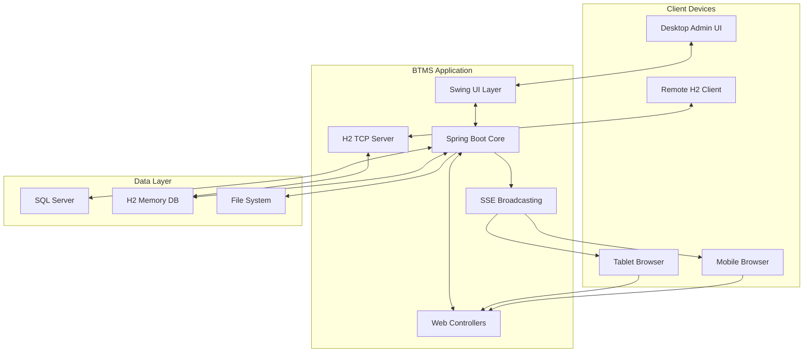

#### 💫 **Enhanced Threading Model (Java 21)**
- **Per-Court Serial Executors**: Mỗi sân có `SerialExecutor` riêng đảm bảo thread-safety
- **Virtual Threads Backing**: Java 21 virtual threads cho optimal scalability
- **Lock-free Operations**: Concurrent collections và atomic operations
- **SSE Async Processing**: Non-blocking event broadcasting với retry logic

### 💻 Công nghệ chính (Tech stack)

#### 🚀 **Runtime & Core Platform**
| Công nghệ | Phiên bản | Mục đích | Tính năng nổi bật |
|-----------|-----------|----------|------------------|
| **Java** | 21 LTS | Runtime platform | Virtual threads, enhanced threading, pattern matching |
| **Spring Boot** | 3.4.0 | Application framework | Auto-configuration, embedded server, production-ready features |
| **Maven** | 3.8+ | Build & dependency management | jpackage integration, multi-profile builds |

#### 🎨 **User Interface Technologies**
| Layer | Công nghệ | Phiên bản | Mục đích |
|-------|-----------|-----------|----------|
| **Desktop UI** | Java Swing | Built-in | Native desktop interface |
| | FlatLaf | 3.4 | Modern Look & Feel với dark/light themes |
| | FlatLaf Extras | 3.4 | Advanced UI components và icons |
| **Web UI** | Thymeleaf | 3.1.x | Server-side template engine |
| | Thymeleaf Layout Dialect | 3.3.x | Layout decorators và template inheritance |
| | Bootstrap | 5.3.3 | Responsive CSS framework |
| | jQuery | 3.7.1 | JavaScript library cho DOM manipulation |

#### 🌐 **Web & API Technologies**
| Công nghệ | Phiên bản | Mục đích | Implementation |
|-----------|-----------|----------|----------------|
| **Spring Web MVC** | 6.1.x | Web framework | REST controllers, view resolvers |
| **Server-Sent Events** | Native | Real-time communication | SseEmitter với async processing |
| **JSON Processing** | Jackson 2.15+ | Data serialization | ObjectMapper với caching |
| **Cross-Origin Support** | Spring CORS | API accessibility | Configurable CORS policies |

#### 🗄️ **Database & Persistence**
| Công nghệ | Phiên bản | Mục đích | Configuration |
|-----------|-----------|----------|---------------|
| **SQL Server** | 2019+ | Primary database | Production data storage |
| **MS SQL JDBC Driver** | 12.6.1+ | Database connectivity | SSL support, connection pooling |
| **H2 Database** | 2.3.232 | TCP server & testing | Remote access via port 9092 |
| **Spring Data JPA** | 3.2.x | Data access layer | Repository pattern, automatic queries |
| **Hibernate** | 6.4.x | ORM implementation | Entity mapping, lazy loading |
| **HikariCP** | 5.1.x | Connection pooling | High-performance connection pool |

#### 🛠️ **Utilities & Libraries**
| Công nghệ | Phiên bản | Mục đích |
|-----------|-----------|----------|
| **ZXing** | 3.5.2 | QR Code generation và scanning |
| **OkHttp** | 4.12.0 | HTTP client với SSE support |
| **OkHttp SSE** | 4.12.0 | Server-Sent Events client library |
| **JCalendar** | 1.4 | Date picker component |
| **OpenPDF** | 1.3.39 | PDF generation và export |
| **Jackson Databind** | 2.15+ | JSON/XML data binding |

#### 🔧 **Development & Testing**
| Công nghệ | Phiên bản | Mục đích |
|-----------|-----------|----------|
| **Maven Compiler Plugin** | 3.11.0 | Java compilation với release flag |
| **Spring Boot Maven Plugin** | 3.4.0 | Fat-jar packaging và repackaging |
| **JPackage Maven Plugin** | 1.6.6 | Native installer generation |
| **Spring Boot Test** | 3.4.0 | Integration testing |
| **JUnit** | 5.10+ | Unit testing framework |

#### 📦 **Packaging & Distribution**
| Công nghệ | Platform | Output | Features |
|-----------|----------|--------|----------|
| **jpackage** | Windows | MSI Installer | JRE bundling, native integration |
| **Windows MSI** | Windows 10/11 | Native installer | Desktop shortcuts, start menu |
| **Java Fat JAR** | Cross-platform | Executable JAR | Self-contained application |

#### 🌐 **Network & Communication**
| Protocol/Tech | Port | Purpose | Implementation |
|---------------|------|---------|----------------|
| **HTTP/HTTPS** | 2345 | Web interface & REST API | Embedded Tomcat server |
| **H2 TCP** | 9092 | Remote database access | H2 TCP server |
| **UDP Multicast** | 50505 | Court monitoring broadcast | Custom ScoreboardBroadcaster |
| **Server-Sent Events** | 2345 | Real-time updates | Spring SseEmitter |

#### 🔒 **Security & Authentication**
| Feature | Implementation | Purpose |
|---------|----------------|---------|
| **PIN Authentication** | 4-digit numeric codes | Court access control |
| **Input Validation** | Spring Validation | SQL injection prevention |
| **CORS Support** | Spring Security | Cross-origin API access |
| **Network Filtering** | IPv4-only interfaces | Security through network isolation |

### ⚙️ Cấu hình mặc định quan trọng

#### 🗄️ **Database Configuration (application.properties)**
```properties
# Server Configuration
server.address=0.0.0.0
server.port=2345
spring.application.name=BadmintonEventTechnology
spring.main.headless=false

# SQL Server Database Configuration
spring.datasource.url=jdbc:sqlserver://localhost:1433;databaseName=badminton_tournament;encrypt=true;trustServerCertificate=true
spring.datasource.username=
spring.datasource.password=
spring.datasource.driver-class-name=com.microsoft.sqlserver.jdbc.SQLServerDriver

# HikariCP Connection Pool Settings (Optimized)
spring.datasource.hikari.maximum-pool-size=20
spring.datasource.hikari.minimum-idle=5
spring.datasource.hikari.idle-timeout=300000
spring.datasource.hikari.max-lifetime=1200000
spring.datasource.hikari.connection-timeout=20000

# JPA/Hibernate Configuration
spring.jpa.hibernate.ddl-auto=update
spring.jpa.show-sql=false
spring.jpa.properties.hibernate.dialect=org.hibernate.dialect.SQLServerDialect
spring.jpa.properties.hibernate.format_sql=true

# Logging Configuration (Optimized for SSE)
logging.level.org.apache.coyote=WARN
logging.level.org.apache.catalina=WARN
logging.level.org.springframework.web.servlet.mvc.method.annotation.ResponseBodyEmitter=WARN
logging.level.org.apache.catalina.core.StandardWrapperValve=WARN
logging.level.org.apache.tomcat.util.net=WARN
logging.level.org.springframework.web.servlet.DispatcherServlet=WARN
```

#### 🌐 **H2 TCP Server Configuration**
| Setting | Value | Purpose |
|---------|-------|---------|
| **Default Port** | 9092 | Remote database access |
| **Bind Address** | 0.0.0.0 | All network interfaces |
| **Auto-start** | Enabled | Automatic startup with application |
| **Database URL** | `jdbc:h2:tcp://[IP]:9092/mem:btms` | Remote connection string |
| **Security** | Basic authentication (sa/empty) | Minimal security for internal use |

#### 📡 **Network Interface Configuration**
| Feature | Implementation | Purpose |
|---------|----------------|---------|
| **IPv4-only Filtering** | Custom NetworkConfig | Security and compatibility |
| **Interface Selection Dialog** | NetworkChooserDialog | User-controlled network binding |
| **Auto-detection** | Network interface enumeration | Automatic valid interface discovery |
| **Fallback Strategy** | Localhost binding | Graceful degradation |

#### 📦 **Maven Build Profiles**
```xml
<!-- Profile selection based on D: drive availability -->
<profiles>
    <!-- Default installation to D:\BTMS if D: drive exists -->
    <profile>
        <id>default-d</id>
        <activation>
            <file><exists>D:/</exists></file>
        </activation>
        <properties>
            <install.dir>D:\BTMS</install.dir>
        </properties>
    </profile>
    
    <!-- Fallback to C:\Program Files\BTMS if no D: drive -->
    <profile>
        <id>fallback-c</id>
        <activation>
            <file><missing>D:/</missing></file>
        </activation>
        <properties>
            <install.dir>C:\Program Files\BTMS</install.dir>
        </properties>
    </profile>
</profiles>
```

### 🔗 Mô hình dữ liệu

#### 🏆 **Core Tournament Entities**

##### **GiaiDau (Tournament Entity)**
```java
@Entity
@Table(name = "GIAI_DAU")
public class GiaiDau {
    // Original Desktop App Fields
    @Id @GeneratedValue private Integer id;
    private String tenGiai;           // Tournament name
    private LocalDate ngayBd;         // Start date
    private LocalDate ngayKt;         // End date
    private LocalDateTime ngayTao;    // Creation timestamp
    private LocalDateTime ngayCapNhat; // Last modified
    private Integer idUser;           // Creator user ID
    
    // Enhanced Web Platform Fields (Phase 1)
    private String moTa;              // Description (NVARCHAR(MAX))
    private String diaDiem;           // Venue location
    private String tinhThanh;         // City/Province
    private String quocGia;           // Country (default: VN)
    private String trangThai;         // Status: upcoming/registration/ongoing/completed/cancelled
    private Boolean noiBat;           // Featured tournament flag
    private String hinhAnh;           // Tournament image URL
    private String logo;              // Tournament logo URL
    
    // Registration Management
    private LocalDate ngayMoDangKi;   // Registration open date
    private LocalDate ngayDongDangKi; // Registration close date
    private Integer soLuongToiDa;     // Maximum participants
    private Integer soLuongDaDangKy;  // Current registration count
    private BigDecimal phiThamGia;    // Entry fee
    
    // Additional Information
    private String giaiThuong;        // Prize information
    private String dienThoai;         // Contact phone
    private String email;             // Contact email
    private String website;           // Tournament website
    private String capDo;             // Level: professional/amateur/youth
    private String theLoai;           // Type: open/invitational/league
    private String sanThiDau;         // Courts information
    private String quyDinh;           // Tournament rules
    
    // Analytics & Social Features
    private Integer luotXem;          // View count
    private BigDecimal danhGiaTb;     // Average rating
    private Integer tongDanhGia;      // Total ratings count
}
```

#### 👥 **User Management Entities**

##### **NguoiDung (User Entity)**
- User authentication and authorization
- Role-based permissions (ADMIN/CLIENT)
- Profile management
- Activity logging

##### **VanDongVien (Player Entity)**
- Player registration and profiles
- Performance statistics
- Club affiliations
- Tournament participation history

##### **CauLacBo (Club Entity)**
- Club information and management
- Member roster
- Tournament registrations
- Statistics and achievements

#### 🏟️ **Match & Court Entities**

##### **BadmintonMatch**
```java
public class BadmintonMatch {
    private String[] names;           // Player/team names [A, B]
    private String[] clubs;           // Club names [A, B]
    private int[] score;              // Current game score [A, B]
    private int[] games;              // Games won [A, B]
    private int gameNumber;           // Current game number (1-based)
    private int server;               // Current server (0=A, 1=B)
    private boolean doubles;          // Singles or Doubles match
    private boolean betweenGamesInterval; // Between games break
    private boolean changedEndsThisGame; // Changed ends in current game
    private boolean matchFinished;    // Match completion status
    private int bestOf;              // Best of X games (1 or 3)
    private long elapsedSec;         // Match duration in seconds
    private List<int[]> gameScores;  // Historical game scores
}
```

##### **CourtSession**
- Court configuration and state
- PIN generation and validation
- Match assignment and management
- Real-time synchronization

##### **ChiTietTranDau & ChiTietVan**
- Detailed match and game records
- Score progression tracking
- Timing and duration information
- Performance analytics data

#### 📊 **Tournament Content & Categories**

##### **NoiDungThiDau (Tournament Categories)**
- Event categories (Men's Singles, Women's Doubles, etc.)
- Age group classifications
- Skill level divisions
- Entry requirements and restrictions

##### **DangKyNoiDung (Category Registrations)**
- Player/team registrations for specific categories
- Entry validation and approval
- Payment and fee management
- Registration status tracking

#### 📈 **Analytics & Reporting Entities**

##### **KetQuaCaNhan & KetQuaDoi**
- Individual and team match results
- Statistical aggregations
- Performance metrics
- Historical comparisons

##### **TournamentGallery**
- Tournament photos and media
- Match highlights and recordings
- Social media integration
- Public galleries and showcases

#### 🔄 **Entity Relationships**

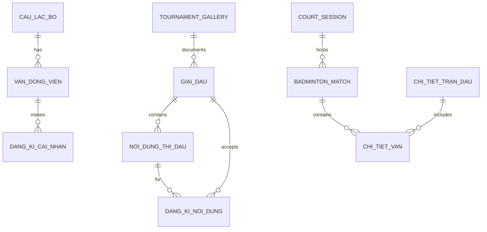

---

## 🚀 TÍNH NĂNG HIỆN TẠI

### 🧭 Điều hướng & màn hình chính (Desktop)

#### MainFrame (JFrame chính)
- **Menu bar**: File, Settings, Tools, Help
- **Tab panels**: 
  - "Sân thi đấu" (BadmintonControlPanel) - Quản lý các sân
  - "Giải đấu" (TournamentPanel) - Quản lý tournament data
  - "Giám sát" (MonitorTab) - Theo dõi tổng thể
  - "Kết quả đã thi đấu" (HistoryTab) - Lịch sử và snapshot

#### System Tray Integration
- **Minimize to tray**: Thu nhỏ xuống system tray
- **Quick actions**: Show/Hide, Exit từ context menu
- **Status indicators**: Icon thay đổi theo trạng thái hoạt động

#### Network Interface Chooser
- **Startup dialog**: Chọn network interface khi khởi động
- **IPv4 filtering**: Chỉ hiển thị interfaces có IPv4 valid
- **Auto-detection**: Tự động detect và ưu tiên interfaces phù hợp

### 🏟️ Quản lý đa sân & điều khiển trận đấu

#### Tạo và quản lý sân
- Tối đa **5 sân** đồng thời (configurable)
- Mỗi sân có **PIN 4 chữ số** unique để remote access
- Thiết lập loại trận: **Đơn nam/nữ, Đôi nam/nữ/mixed**
- Cấu hình số ván: **Best of 1** hoặc **Best of 3**

#### Control Interface cho mỗi sân
- Điểm số real-time với các nút **+/-** cho từng bên
- **Đổi sân** (change ends) và **reset trận đấu**
- **Ván tiếp theo** khi kết thúc ván
- Hiển thị thông tin: tên players/teams, loại trận, trạng thái

### 🌐 Web Platform (Tournament Hub)

Web Platform phục vụ 3 mục đích chính:
1. **Landing Page**: Giới thiệu, quảng bá tính năng BTMS
2. **App Hub**: Trang dành cho người quan tâm đến ứng dụng BTMS Desktop
3. **Tournament Hub**: Trung tâm giải đấu cầu lông công khai

#### 🏠 Landing Page (`/`, `/home`)
- **Hero Section**: Giới thiệu BTMS với CTA buttons
- **Stats Counter**: Hiển thị thống kê động từ database
  - Tổng số giải đấu, người đăng ký, trận đấu
  - Sử dụng CountUp.js với animation
- **Featured Tournaments**: Carousel giải đấu nổi bật
- **App Showcase**: Demo tính năng ứng dụng Desktop
- **SEO Optimized**: Meta tags, structured data

#### 🏆 Tournament Hub (`/tournaments`)
- **Tournament Home** (`/tournaments`):
  - Featured tournaments với Swiper carousel
  - Live tournaments section với real-time pulse
  - Category stats (Amateur, Semi-pro, Professional, v.v.)
  - Quick registration CTA

- **Tournament List** (`/tournaments/list`):
  - Grid/List view toggle với persistence
  - AJAX live filters (không reload trang)
  - Multi-filter: trạng thái, địa điểm, cấp độ, thể loại
  - Quick View modal với tournament preview
  - Infinite scroll pagination
  - Search autocomplete với debounce

- **Tournament Detail** (`/tournaments/{id}`):
  - Full tournament information
  - Image gallery với lightbox
  - Registration form với validation
  - Related tournaments carousel
  - Bracket/Schedule tabs (future)

- **Tournament Calendar** (`/tournaments/calendar`):
  - FullCalendar integration
  - Month/Week/List views
  - Event modal on click
  - Color-coded by tournament status

#### 📱 App Hub (`/app`)
- Thông tin chi tiết về BTMS Desktop
- Screenshots và demo
- Download section
- FAQ section

#### 🔐 Remote Scoreboard (Legacy)
- **PIN Entry**: `http://[IP]:2345/pin`
- **Scoreboard**: `/scoreboard/{pin}`
- Real-time score updates via SSE
- Mobile-friendly touch controls

### 🔌 REST API & SSE

#### 📋 **API Overview**
BTMS cung cấp **dual API architecture** để hỗ trợ cả PIN-based access và direct access:

| API Mode | Base URL | Authentication | Purpose |
|----------|----------|----------------|---------|
| **PIN Mode** | `/api/court/{pin}/**` | 4-digit PIN | Multi-court với PIN isolation |
| **Direct Mode** | `/api/scoreboard/**` | None | Single court direct access |

#### 🏟️ **PIN-based Court API** (`/api/court/{pin}`)

##### **Court Information & Status**
```http
GET    /api/court/{pin}                 # Basic court information
GET    /api/court/{pin}/status          # PIN validation & detailed court status  
GET    /api/court/{pin}/sync            # Complete match snapshot data
GET    /api/court/{pin}/stream          # SSE stream for real-time updates
GET    /api/court/health                # API health check endpoint
```

##### **Score Control Operations**
```http
POST   /api/court/{pin}/increaseA       # Increase team A score (+1)
POST   /api/court/{pin}/decreaseA       # Decrease team A score (-1)
POST   /api/court/{pin}/increaseB       # Increase team B score (+1)  
POST   /api/court/{pin}/decreaseB       # Decrease team B score (-1)
```

##### **Match Control Operations**
```http
POST   /api/court/{pin}/reset           # Reset entire match to 0-0
POST   /api/court/{pin}/next            # Proceed to next game
POST   /api/court/{pin}/swap            # Swap court ends
POST   /api/court/{pin}/change-server   # Change server
POST   /api/court/{pin}/undo            # Undo last action
```

##### **Debug & Testing Endpoints**
```http
GET    /api/court/{pin}/test            # Quick controller functionality test
POST   /api/court/{pin}/{action}        # Generic action endpoint for testing
```

#### 📊 **Direct Scoreboard API** (`/api/scoreboard`)

##### **No-PIN Access Endpoints**
```http
GET    /api/scoreboard                  # Basic scoreboard information
GET    /api/scoreboard/sync             # Complete match snapshot
GET    /api/scoreboard/stream           # SSE stream for updates
```

##### **Score & Match Control (No-PIN)**
```http
POST   /api/scoreboard/increaseA        # Increase team A score
POST   /api/scoreboard/decreaseA        # Decrease team A score
POST   /api/scoreboard/increaseB        # Increase team B score
POST   /api/scoreboard/decreaseB        # Decrease team B score
POST   /api/scoreboard/reset            # Reset match
POST   /api/scoreboard/next             # Next game
POST   /api/scoreboard/swap             # Swap court ends
POST   /api/scoreboard/change-server    # Change server
POST   /api/scoreboard/undo             # Undo last action
```

#### 🚀 **Server-Sent Events (SSE) Architecture**

##### **SSE Stream Endpoints**
```http
GET    /api/court/{pin}/stream          # PIN-specific SSE stream
GET    /api/scoreboard/stream           # Direct SSE stream
```

##### **SSE Event Types & Payload**
| Event Type | Purpose | Payload |
|------------|---------|---------|
| `init` | Initial connection state | Complete match data |
| `update` | Real-time match updates | Changed fields only |

##### **SSE Implementation Features**
- **Async Processing**: Non-blocking event broadcasting
- **Client Throttling**: 80ms minimum interval between events
- **Automatic Reconnection**: Client-side fallback to polling
- **JSON Payload Caching**: Performance optimization for repeated data
- **Thread-safe Broadcasting**: Concurrent client management

#### 📝 **API Response Format**

##### **Standard Success Response**
```json
{
  "names": ["Team A", "Team B"],
  "clubs": ["Club A", "Club B"], 
  "score": [21, 19],
  "games": [1, 0],
  "gameNumber": 1,
  "server": 0,
  "doubles": false,
  "betweenGamesInterval": false,
  "changedEndsThisGame": false,
  "matchFinished": false,
  "bestOf": 3,
  "elapsedSec": 1234,
  "gameScores": [[21, 19]]
}
```

##### **Error Handling**
- **Graceful Degradation**: Fallback mechanisms for connection failures
- **Automatic Recovery**: SSE reconnection strategies  
- **Comprehensive Logging**: Detailed error tracking and debugging

### 🗃️ Các mô-đun dữ liệu/ghi nhật ký (trích yếu)

#### Tournament Data Management
- **Tournaments**: Quản lý thông tin giải đấu
- **Contents**: Nội dung thi đấu (đơn nam, đôi nữ, v.v.)
- **Clubs**: Danh sách câu lạc bộ tham gia
- **Registrations**: Đăng ký vận động viên theo giải

#### Court & Match Logging
- **Court states**: Lưu trạng thái sân theo thời gian
- **Score history**: Lịch sử thay đổi điểm số
- **Match results**: Kết quả trận đấu hoàn tất
- **System events**: Log hoạt động hệ thống

#### File Storage
- **Screenshots**: Capture màn hình scoreboard
- **Exports**: Xuất dữ liệu ra file (CSV, JSON)
- **Backups**: Sao lưu dữ liệu định kỳ
- **Logs**: File log hệ thống và error

---

## 🔮 KẾ HOẠCH TƯƠNG LAI

### 🔮 Phát thảo tính năng dự kiến

#### 📋 Tính năng đã hoàn thành (v2.1.0)

##### ✅ Desktop Application (Core)
- ✅ **Quản lý đa sân**: Hỗ trợ tối đa 5 sân đồng thời với PIN unique
- ✅ **Real-time control**: Desktop + Web interface, SSE streaming
- ✅ **Tournament management**: Giải đấu, nội dung, câu lạc bộ, đăng ký
- ✅ **H2 TCP Server**: Remote database access cho máy khác
- ✅ **IPv4 filtering**: Network interface chỉ nhận IPv4
- ✅ **MSI packaging**: Windows installer với JRE bundled
- ✅ **Multi-display support**: Vertical/horizontal scoreboards
- ✅ **Virtual Threads**: SerialExecutor per-court với Java 21 virtual threads

##### ✅ Web Platform (Tournament Hub)
- ✅ **Landing Page**: Hero, stats, featured tournaments, app showcase
- ✅ **Tournament Hub**: Dashboard, list, detail, calendar views
- ✅ **Tournament List**: Grid/List toggle, AJAX filters, Quick View modal
- ✅ **Tournament Detail**: Full info, gallery, registration form
- ✅ **Tournament Calendar**: FullCalendar integration với event modal
- ✅ **Responsive Design**: Mobile-first, Bootstrap 5, touch-friendly
- ✅ **Dynamic Stats**: Database-driven statistics với caching
- ✅ **Image Lazy Loading**: Performance optimization cho images
- ✅ **AJAX Live Filters**: Filter không reload trang, history.pushState

##### ✅ Performance & Caching
- ✅ **Spring Cache**: Multi-layer caching với ConcurrentMapCacheManager
  - `featured-tournaments`: Giải nổi bật
  - `tournament-stats`: Thống kê tổng hợp
  - `tournament-detail`: Chi tiết theo ID
  - `upcoming-tournaments`: Giải sắp diễn ra
  - `ongoing-tournaments`: Giải đang diễn ra
  - `landing-page-stats`: Stats cho landing page
- ✅ **Cache Eviction**: Auto-evict khi CRUD operations
- ✅ **Lazy Loading**: Images với `loading="lazy"` attribute
- ✅ **Production Logger**: BTMSUtils.log với debug toggle

#### 🚧 Phiên bản 2.2 (Đang lên kế hoạch)

##### 🌐 Quốc tế hoá & Bảo mật
- [ ] **Multi-language Support**: 
  - Interface tiếng Anh/Việt Nam
  - Localization cho templates và messages
  - Dynamic language switching
- [ ] **Enhanced Security**:
  - JWT token authentication cho API
  - Role-based access control chi tiết hơn
  - PIN encryption và session management
  - HTTPS support với SSL certificates

##### ☁️ Cloud & Mobile
- [ ] **Cloud Integration**:
  - Auto backup tournament data lên cloud storage
  - Real-time sync giữa multiple venues
  - Cloud-based tournament analytics
- [ ] **Mobile Applications**:
  - Native Android/iOS companion app
  - Referee mobile app với offline capability
  - Push notifications cho score updates
  - QR code scanner integration

##### 📊 Analytics & Reporting
- [ ] **Advanced Analytics**:
  - Match statistics và performance metrics
  - Player/team performance tracking
  - Tournament trend analysis
  - Export reports (PDF, Excel, CSV)
- [ ] **Tournament Bracket System**:
  - Automated bracket generation
  - Draw management với seeding
  - Knockout/round-robin tournaments
  - Live bracket updates

#### 🔮 Phiên bản 3.0 (Tương lai xa)

##### 🏗️ Kiến trúc & Scale
- [ ] **Microservices Architecture**:
  - Tách thành services độc lập (Court, Tournament, User, Analytics)
  - API Gateway và service discovery
  - Docker containerization
  - Kubernetes orchestration
- [ ] **Multi-venue Support**:
  - Sync tournaments across multiple locations
  - Central management dashboard
  - Venue-specific configurations
  - Cross-venue competitions

##### 🤖 AI & Automation
- [ ] **AI-powered Features**:
  - Computer vision auto-scoring
  - Video analysis và highlight generation
  - Predictive analytics cho match outcomes
  - Smart scheduling optimization
- [ ] **Live Streaming Integration**:
  - Real-time video streaming
  - Multi-camera support
  - Automated highlight clips
  - Social media integration

##### 🎯 Advanced Features
- [ ] **Player Rating System**:
  - ELO-based ranking algorithm
  - Performance tracking over time
  - Skill level assessments
  - Matchmaking recommendations
- [ ] **Sponsor & Commercial**:
  - Advertisement management system
  - Branding customization
  - Revenue tracking
  - Sponsor portal integration

#### 💡 Community & Development

##### 🤝 Open Source Contributions
- [ ] **Plugin Architecture**: Extensible system cho custom features
- [ ] **API Documentation**: Comprehensive REST API docs
- [ ] **SDK Development**: Client libraries cho third-party integration
- [ ] **Community Portal**: Feature requests, bug reports, discussions

##### 🧪 Quality & Performance
- [ ] **Testing Suite**: Unit, integration, và e2e testing
- [ ] **Performance Monitoring**: Real-time performance metrics
- [ ] **Load Testing**: Support cho large-scale tournaments
- [ ] **Accessibility**: WCAG compliance cho web interfaces

### 🔄 Luồng hoạt động sơ bộ

#### 📋 Workflow tổng quan hệ thống

##### 🚀 Quy trình khởi động (Startup Flow)
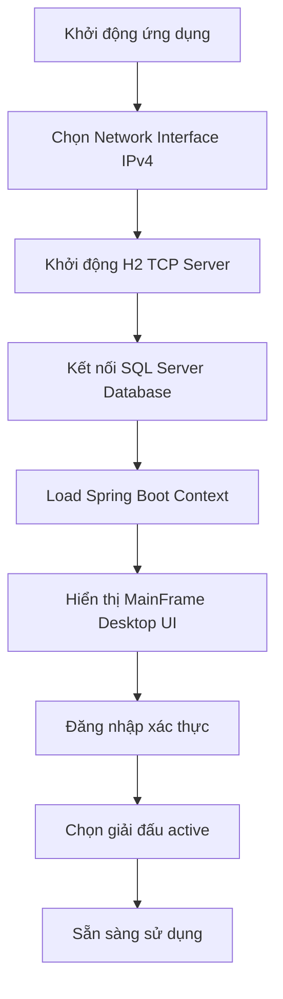

##### 🏆 Quy trình quản lý giải đấu (Tournament Management)
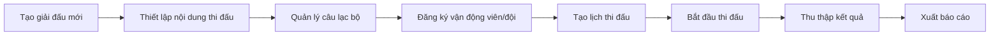

#### 🏟️ Quy trình quản lý sân thi đấu

##### 🎮 Thiết lập và điều khiển sân (Court Management Flow)
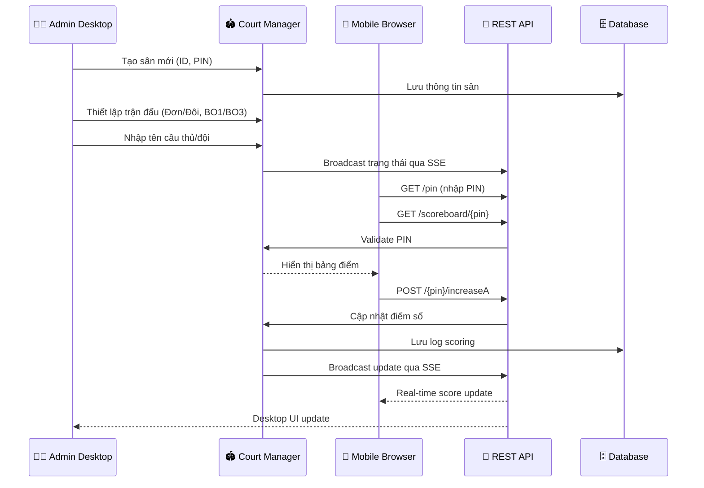

##### 📊 Chu trình thi đấu (Match Lifecycle)
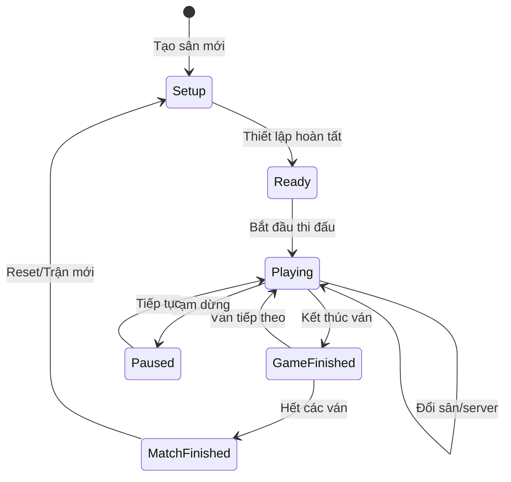

#### 🌐 Luồng Web Interface

##### 📱 Quy trình điều khiển từ xa (Remote Control Flow)
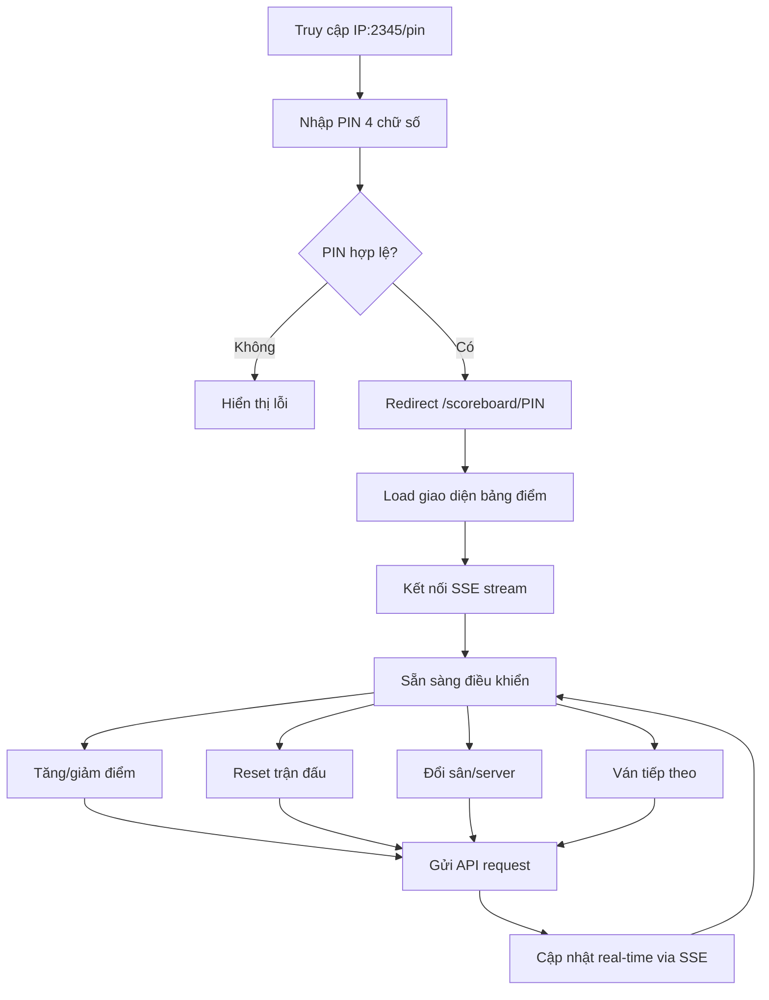

#### 🔄 Luồng dữ liệu (Data Flow)

##### 💾 Luồng lưu trữ và đồng bộ (Data Sync Flow)
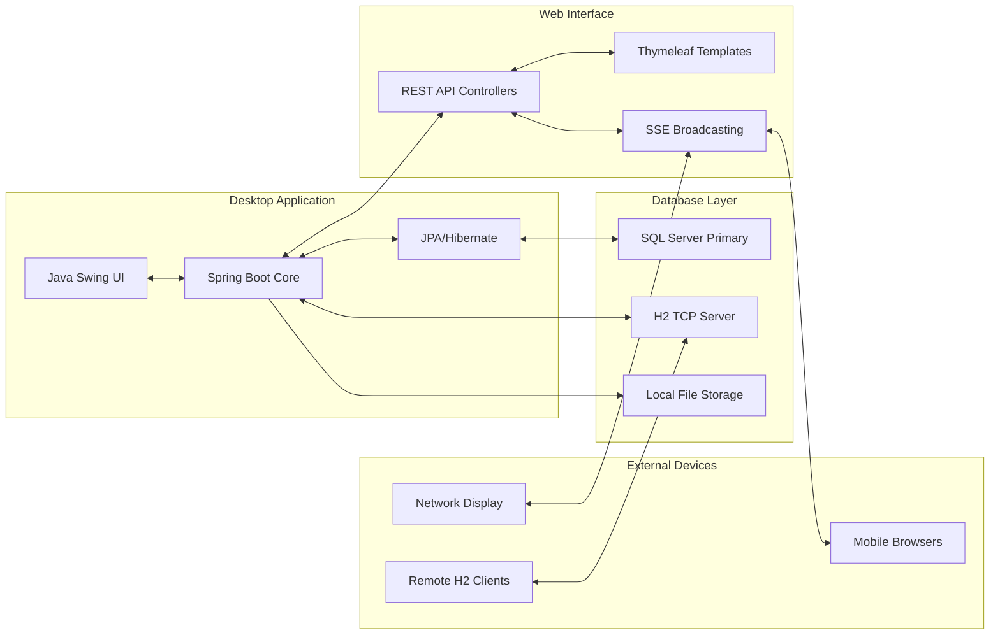

#### 🔧 Luồng setup và deployment

##### 📦 Quy trình triển khai (Deployment Process)
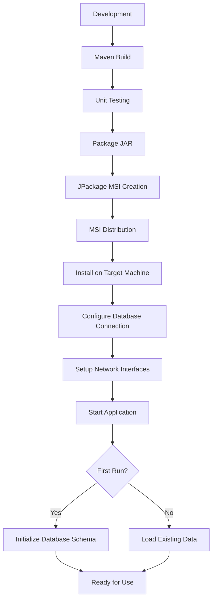

##### 🌐 Network Architecture Flow
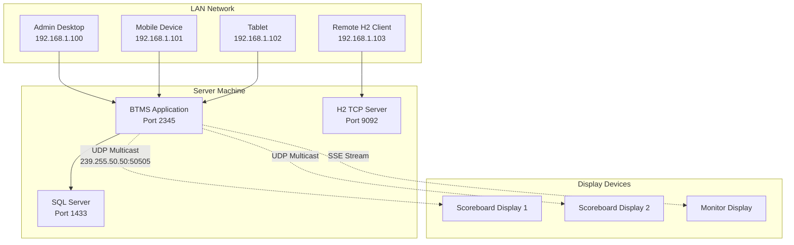

#### ⚡ Performance & Monitoring Flow

##### 📈 Luồng giám sát hiệu năng
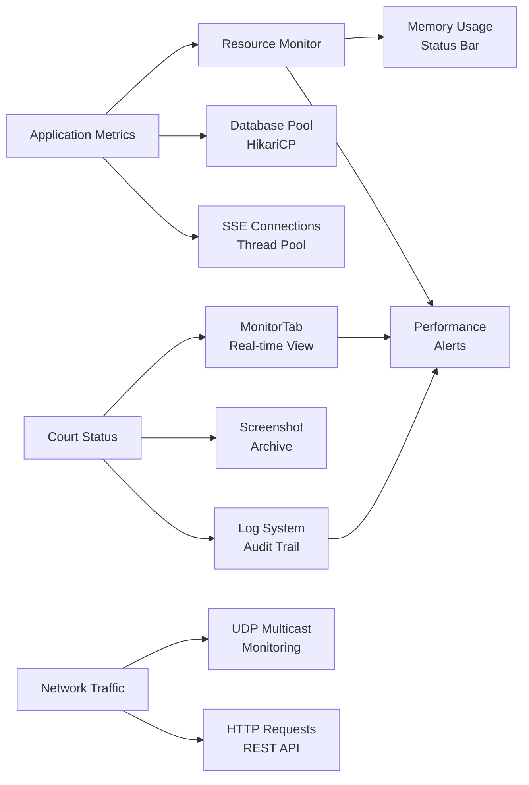

---

## 🔧 VẬN HÀNH & BẢO TRÌ

### 🧪 Kiểm thử & giám sát

#### Testing Strategy
- **Unit Tests**: JUnit cho logic core
- **Integration Tests**: Spring Boot Test cho API
- **Manual Testing**: UI testing cho desktop components
- **Performance Testing**: Load testing cho concurrent users

#### Monitoring & Logging
- **Application Logging**: SLF4J + Logback
- **Performance Metrics**: Memory usage hiển thị trên status bar
- **Error Tracking**: Exception logging và user notification
- **System Health**: Database connection status, SSE connection count

### 🔒 Bảo mật & quyền truy cập

#### Current Security Measures
- **PIN-based Access**: 4-digit PIN cho mỗi sân
- **Local Network**: Chỉ chạy trên LAN, không expose ra internet
- **Input Validation**: Validate tất cả API inputs
- **Session Management**: Temporary sessions cho web interface

#### Security Considerations
- **No Authentication**: Chưa có user authentication system
- **PIN Enumeration**: 4-digit PIN có thể bị brute force
- **HTTP Only**: Chưa hỗ trợ HTTPS
- **Database Security**: SQL injection protection qua JPA

### ⚡ Hiệu năng & tối ưu

#### Performance Optimizations
- **Connection Pooling**: HikariCP cho database connections
- **Lazy Loading**: JPA lazy loading cho entities
- **Static Resource Caching**: Browser caching cho CSS/JS
- **SSE Efficiency**: Event-driven updates thay vì polling

#### Quản lý thread & đa sân hiện đại
- Từ phiên bản 2.1, mọi thao tác cập nhật trạng thái sân đều được thực thi tuần tự qua `SerialExecutor` (per-court), sử dụng virtual threads (Java 21) làm backing executor.
- Điều này đảm bảo không race condition khi thao tác đồng thời nhiều sân, đồng thời cho phép mở rộng số lượng sân lớn mà không bị giới hạn bởi số lượng thread vật lý.
- API `submitToCourt` giúp các thao tác cập nhật điểm số, trạng thái trận đấu, ghi DB... đều an toàn và hiệu quả.

#### Resource Management
- **Memory Usage**: Monitor và display trên status bar
- **Thread Management**: Controlled thread pools cho SSE
- **Database Optimization**: Proper indexing và query optimization
- **Garbage Collection**: JVM tuning cho desktop performance

### 📦 Đóng gói & cài đặt (Windows MSI)

#### JPackage Configuration
- **Runtime**: Bundle JRE 21 với application
- **MSI Installer**: Windows native installer
- **Auto-updater**: Future plan cho automatic updates
- **System Integration**: Desktop shortcuts, Start menu entries

#### Installation Process
- **Pre-requisites**: Windows 10/11 64-bit
- **Database Setup**: User cần setup SQL Server trước
- **Network Configuration**: Auto-detect network interfaces
- **First Run**: Configuration wizard cho database connection

### 🧭 Hướng dẫn vận hành nhanh

#### Quick Start Guide
1. **Cài đặt**: Chạy MSI installer
2. **Database**: Thiết lập SQL Server connection
3. **Network**: Chọn network interface IPv4
4. **Tournament**: Tạo giải đấu và nội dung thi đấu
5. **Courts**: Tạo sân với PIN và bắt đầu thi đấu

#### Daily Operations
- **Tạo sân mới**: Chọn loại trận, nhập tên players, generate PIN
- **Remote control**: Share PIN với users để điều khiển từ mobile
- **Monitoring**: Tab "Giám sát" để theo dõi tất cả sân
- **Results**: Tab "Kết quả đã thi đấu" để xem ảnh chụp/snapshot

#### Troubleshooting
- **Connection Issues**: Check network interface và firewall
- **Database Problems**: Verify SQL Server connection string
- **Performance**: Monitor memory usage và restart nếu cần
- **SSE Issues**: Fallback to polling mode tự động

---

## 📊 Kết luận

**Badminton Tournament Management System (BTMS) v1.0.0** là một hệ thống hoàn chỉnh và mạnh mẽ cho việc quản lý giải cầu lông đa sân với kiến trúc hybrid độc đáo. Dự án thể hiện sự kết hợp tinh tế giữa desktop application truyền thống và web platform hiện đại.

### ✅ **Điểm mạnh hiện tại**

#### 🏗️ **Kiến trúc & Công nghệ**
- **Hybrid Desktop/Web**: Kiến trúc độc đáo kết hợp Java Swing và Spring Boot trong cùng JVM
- **Modern Tech Stack**: Java 21, Spring Boot 3.4.0, FlatLaf, Bootstrap 5.3.3
- **Real-time Performance**: Server-Sent Events + UDP Multicast cho sync tức thì
- **Cross-platform Access**: Desktop admin + responsive web interface cho mọi thiết bị

#### 🏟️ **Quản lý Tournament**
- **Multi-court Management**: Hỗ trợ 5 sân đồng thời với PIN-based access control
- **Professional Data Model**: Tournament, Player, Club management với web platform integration
- **Real-time Monitoring**: Monitor tab cho giám sát tổng thể các sân
- **Comprehensive Analytics**: View count, ratings, performance tracking

#### 🌐 **Network & Connectivity**
- **H2 TCP Server**: Remote database access cho multi-machine setup
- **IPv4-only Filtering**: Security through network isolation
- **Network Interface Selection**: Flexible deployment configuration
- **MSI Packaging**: Professional Windows deployment với JRE bundled

#### 📱 **Mobile & Web Features**
- **PIN Authentication**: 4-digit secure access per court
- **QR Code Integration**: Quick mobile access
- **Touch-friendly Interface**: Optimized for tablets và touchscreens
- **Responsive Design**: Bootstrap-based mobile-first design

### 🚀 **Tầm nhìn phát triển**

#### 🎯 **Roadmap v1.1-v1.2 (2025)**
- **Enhanced Security**: JWT authentication, HTTPS support, advanced PIN encryption
- **Multi-language Support**: English/Vietnamese localization với dynamic switching
- **Cloud Integration**: Auto-backup, real-time sync across venues
- **Mobile Apps**: Native Android/iOS companion applications

#### 🔮 **Vision v2.0+ (2026+)**
- **Microservices Architecture**: Scalable service-oriented design
- **AI-powered Features**: Computer vision auto-scoring, predictive analytics
- **Live Streaming Integration**: Real-time video với automated highlights
- **Multi-venue Management**: Cross-location tournament coordination

### 💡 **Giá trị cốt lõi**

#### 🎯 **Innovation trong Sports Tech**
BTMS không chỉ là một tournament management tool mà là **nền tảng số hóa toàn diện** cho badminton community. Hệ thống pioneered việc kết hợp desktop administrative control với mobile-friendly real-time access.

#### 🏆 **Professional Tournament Management**
- **Scalability**: Từ local club tournaments đến professional competitions
- **Reliability**: Thread-safe operations, connection pooling, graceful degradation
- **User Experience**: Intuitive desktop interface + mobile-optimized web controls
- **Data Integrity**: Comprehensive logging, backup systems, audit trails

#### 🌍 **Community Impact**
Hệ thống đã được thiết kế để phục vụ từ **câu lạc bộ địa phương** đến **giải đấu chuyên nghiệp**, mang lại:
- **Transparency**: Real-time scoring visibility cho players và spectators
- **Efficiency**: Automated tournament management giảm workload cho organizers
- **Accessibility**: Mobile access cho referees và officials
- **Professionalism**: Enterprise-grade features cho major tournaments

### 📈 **Technical Excellence**

#### 🎨 **Architecture Highlights**
- **Non-headless Spring Boot**: Breakthrough integration của desktop + web
- **Java 21 Features**: Virtual threads, enhanced performance, modern language features
- **Thread-safe Multi-court**: Concurrent operations with per-court isolation
- **Real-time Broadcasting**: Low-latency updates via SSE và UDP multicast

#### 🔧 **Engineering Best Practices**
- **Clean Architecture**: Separation of concerns, dependency injection
- **Performance Optimization**: Connection pooling, caching, async processing
- **Error Handling**: Comprehensive exception management và graceful recovery
- **Testing Strategy**: Unit tests, integration tests, performance validation

### 🎊 **Conclusion**

**BTMS v1.0.0** represents a **significant achievement** trong sports technology, demonstrating how modern software engineering principles có thể được applied để create comprehensive tournament management solutions. 

Dự án successfully combines **enterprise-level architecture** với **user-friendly interfaces**, creating a platform that scales from **local clubs** to **professional tournaments** while maintaining **high performance** và **reliability**.

Với **solid foundation** được established và **clear roadmap** cho future development, BTMS positioned để become một **leading solution** trong badminton tournament management landscape.

---

**🏸 "Empowering Badminton Communities Through Technology" 🏸**

### 📈 Changelog v2.1.0 (26/11/2025)
- ✨ **Web Platform**: Tournament Hub hoàn chỉnh
- ✨ **AJAX Filters**: Live filtering không reload trang
- ✨ **Dynamic Stats**: Database-driven statistics
- ✨ **Spring Cache**: Multi-layer caching với 9 cache names
- ✨ **Image Lazy Loading**: Performance optimization
- ✨ **Production Logger**: BTMSUtils.log utility
- 🐛 **Thymeleaf Fix**: Iterator syntax correction
- 🐛 **Console Cleanup**: Replace console.log với log utility

---

*📅 Báo cáo được cập nhật: November 28, 2025*  
*🏗️ Phiên bản hệ thống: v1.0.0*  
*👨‍💻 Tác giả: Nguyen Viet Hau (@NguyenHau-IT)*  
*📄 License: MIT License*  
*🔗 Repository: [GitHub - BTMS](https://github.com/NguyenHau-IT/Badminton_Tournament_Management_System_DB_SQLSRV)*
